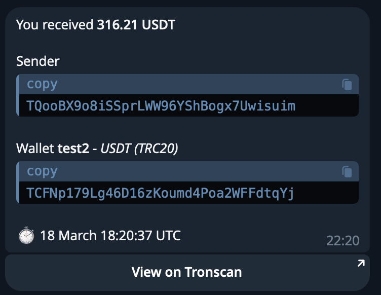

# Crypto Notifier Bot

Telegram bot for instant notifications about transactions on selected wallets. The bot utilizes webhooks from QuickNode and supports TRC20 and ERC20 wallets. It also allows users to query wallet balances (using QuickNode for ERC20 and Tronscan for TRC20).

## Demo

Here’s what a typical notification looks like:



## Features
- Supports **ERC20** and **TRC20** wallets
- Real-time transaction notifications via **QuickNode Webhooks**
- Wallet balance inquiries via QuickNode (ERC20) and Tronscan (TRC20)
- Integrated with **PostgreSQL** for data persistence
- Built with **FastAPI**, **Aiogram**, and **Docker**

## Architecture

- **Telegram Bot (Aiogram)** — user interaction
- **FastAPI Backend** — receives webhooks and forwards alerts
- **PostgreSQL** — stores user and wallet data
- **QuickNode** — Ethereum/Tron blockchain events
- **TronScan API** — TRC20 balance data

## Environment Variables

| Variable             | Description                                            |
|----------------------|--------------------------------------------------------|
| `MODE`               | `DEV` or `PROD` environment mode                       |
| `DB_HOST`            | PostgreSQL host                                        |
| `DB_PORT`            | PostgreSQL port                                        |
| `DB_USER`            | PostgreSQL username                                    |
| `DB_PASS`            | PostgreSQL password                                    |
| `DB_NAME`            | PostgreSQL database name                               |
| `WEBHOOK_BASE_URL`   | Base URL for receiving webhooks (e.g. http://localhost:8000) |
| `QUICKNODE_API_KEY`  | API key for QuickNode                                  |
| `QUICKNODE_ENDPOINT_URL` | QuickNode endpoint URL (use `{chain}` placeholder) |
| `TRONSCAN_API_KEY`   | API key for Tronscan                                   |
| `TOKEN`              | Telegram Bot API token                                 |

## Installation
* Dev:
```bash
docker-compose up --profile dev --build #postgres
poetry install && poetry shell
python3 bot.py
uvicorn main:app --debug
```
* Prod:
```bash
docker-compose up --build #fastapi, aiogram, postgres
```
